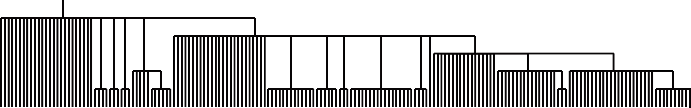
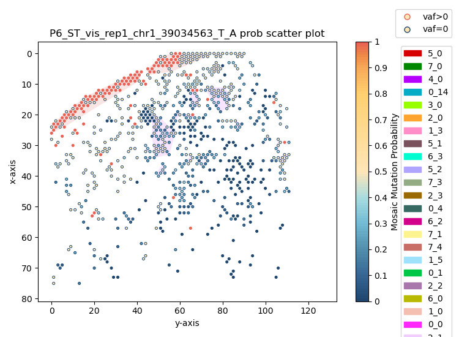
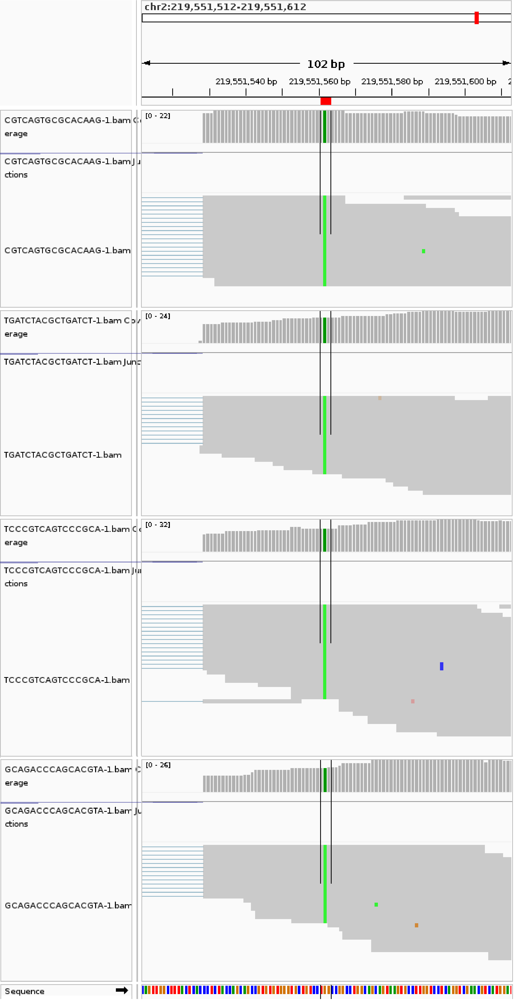
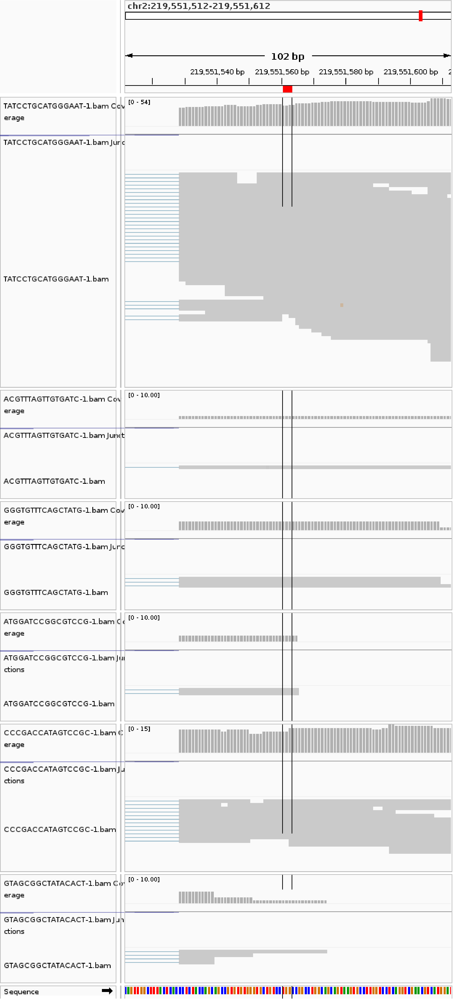

# Outputs

This page summarizes important files generated by the current SpaceTracer workflow.

## Key intermediate outputs

- `output_dir/cluster/cluster.txt` and `output_dir/cell_num.txt`
  Cluster assignments and cell-number support for downstream genotype modeling.

- `output_dir/bam_processing/IN.bam`, `output_dir/bam_processing/IN_filter.bam`
  In-tissue BAM and filtered BAM used by `mpileup` and read-level feature extraction.

- `output_dir/mpileup/raw_mpileup.txt`, `output_dir/mpileup/filter_mpileup.txt`, `output_dir/mpileup/umi_combine_chunk_manifest.tsv`
  Raw/filter mpileup evidence and chunk manifest used by `umi_combine`.

- `output_dir/umi_combine/spot.count.list.csv`, `output_dir/umi_combine/error.count.list.csv`
  Chunk-manifest files that point to per-chunk parquet outputs for spot/error evidence.

- `output_dir/prior.txt`
  Prior table used in `genotyping`.

- `output_dir/genotyping/genotyping_chunk_manifest.tsv`
  Per-chunk genotype outputs (for example `ind_geno_filter.out`, `spot_geno.out`, `cluster_vaf.out`) under `output_dir/genotyping/<chunk>/`.

- `output_dir/spatial_feature/<sample>/spatial_feature_chunk_manifest.tsv`
  Spatial feature chunk outputs.

- `output_dir/read_feature/<sample>/read_feature_chunk_manifest.tsv`
  Read-level feature chunk outputs.

- `output_dir/mappability_feature/mappability_feature.txt`
  Mappability feature table.

- `output_dir/RNA_feature/RNA_feature.txt`
  RNA-level feature table (with ASE/hFDR/editing-related annotations).

- `output_dir/all_feature.txt`
  Integrated feature table produced by `merge_feature`.

- `output_dir/all_feature.parquet`


## Mutation-prediction outputs

Typical outputs from `mutation_prediction` are:

- `output_dir/mutation_prediction/Sample_total_pred_truesites.vcf`
- `output_dir/mutation_prediction/Sample_total_pred_truesites_PASS.vcf`

```text
#CHROM	POS	ID	REF	ALT	QUAL	FILTER	INFO
chr1	16562519	.	C	A	.	PASS	DP=196;ALT_DP=24;VAF=0.122449;NUM_SPOTS=135;NUM_MUT_SPOTS=23;DNA_MUT_TYPE=A[C>A]A;RNA_MUT_TYPE=T[G>T]T
chr1	19682510	.	G	A	.	PASS	DP=79;ALT_DP=17;VAF=0.21519;NUM_SPOTS=71;NUM_MUT_SPOTS=17;DNA_MUT_TYPE=T[C>T]T;RNA_MUT_TYPE=T[C>T]T
chr1	36393565	.	G	A	.	PASS	DP=525;ALT_DP=89;VAF=0.169524;NUM_SPOTS=368;NUM_MUT_SPOTS=79;DNA_MUT_TYPE=T[C>T]C;RNA_MUT_TYPE=T[C>T]C
chr1	46675536	.	G	A	.	PASS	DP=118;ALT_DP=20;VAF=0.160494;NUM_SPOTS=73;NUM_MUT_SPOTS=13;DNA_MUT_TYPE=G[C>T]T;RNA_MUT_TYPE=G[C>T]T
chr1	155234903	.	C	T	.	PASS	DP=39;ALT_DP=3;VAF=0.0769231;NUM_SPOTS=39;NUM_MUT_SPOTS=3;DNA_MUT_TYPE=G[C>T]T;RNA_MUT_TYPE=A[G>A]C
```

## Visualization and validation

### 1) Lineage reconstruction with PhyloSOLID

After obtaining final predicted sites, you can run PhyloSOLID to infer lineage relationships.



### 2) Spatial probability scatter plot

SpaceTracer supports spatial visualization of mutation probability and mutant/non-mutant spot patterns.



### 3) IGV validation views

To manually validate candidate calls, IGV snapshots can be used to compare mutant-like and non-mutant/reference-homozygous spots.

**Mutant spots**



**Non-mutant/reference-homozygous spots**


